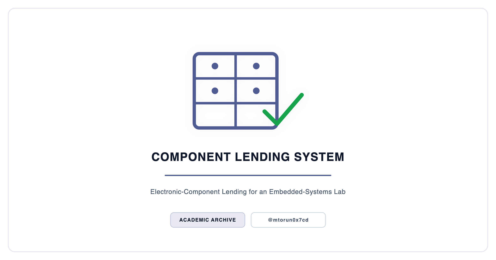
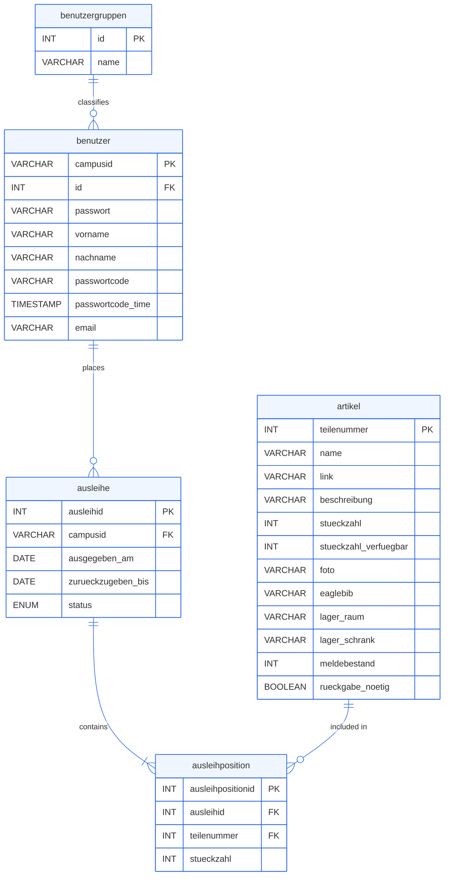
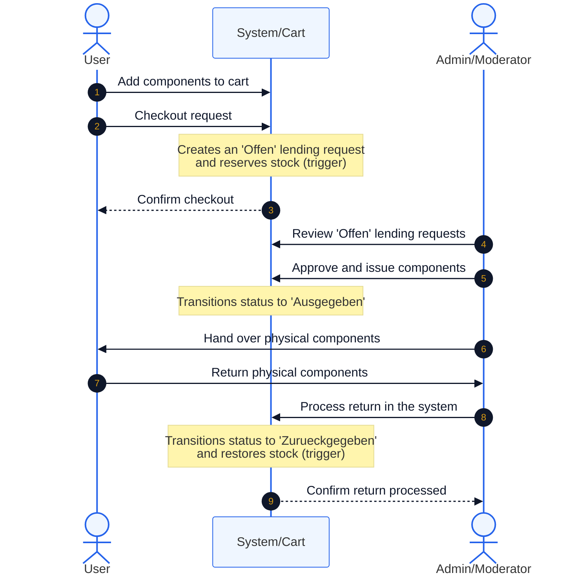

<p align="center">
  <picture>
    <source media="(prefers-color-scheme: dark)" srcset="docs/social_preview_dark.png" />
    <source media="(prefers-color-scheme: light)" srcset="docs/social_preview_light.png" />
    
  </picture>
</p>

# Component Lending System

> Web-based inventory and lending platform for the electronic components of a university embedded-systems lab, deployed on a Raspberry Pi within the campus network.

[](https://github.com/mtorun0x7cd/component-lending-system/actions/workflows/ci.yml)


> **Archived.** A frozen record of completed work, preserved for reference and not actively maintained. See [`SECURITY.md`](SECURITY.md) for scope and disclosures.

---

## Overview

The **Component Lending System** (*Bauteilverwaltung*) is a PHP web application for managing the lending of electronic components in the Embedded Systems (*Eingebettete Systeme*) lab at TH Köln. Students building microcontroller prototypes — for example on the STM32 Nucleo F401RE — borrow microcontroller modules, sensors, actuators, and passive components from the lab. The system replaces manual tracking with a self-service web interface covering the lending lifecycle: browsing the catalogue, reserving items through a shopping cart, checkout, issue, and return.

The application implements role-based access control over four tiers (*Neu* → *Student* → *Moderator* → *Administrator*), a normalized MySQL schema whose triggers recalculate available stock on each lending transaction, and a Bootstrap 4 responsive frontend. It is operated on a Raspberry Pi inside the TH Köln campus network (*Hochschulnetz*) and is reachable on campus or over VPN.

The repository carries the project's arc42 documentation in AsciiDoc, covering requirements engineering (17 use cases, LF01–LF17), system specification, and architecture. This is an archived academic team deliverable, retained for reference; it is not maintained and is not suitable for production use (see [Security](#security)).

## Context

| Dimension | Detail |
| :--- | :--- |
| **Institution** | TH Köln (University of Applied Sciences) |
| **Program** | Computer Science & Engineering (Technische Informatik), B.Sc. |
| **Course** | Systementwurfs-Praktikum (Systems Design Lab) (SYP) |
| **Supervising lecturers** | Dr. T. Krawutschke, M. Völker (TH Köln) |
| **Semester** | Winter 2019/20 |
| **Type** | Team |

## Features

- **Component catalogue** — browse the lab's components with photos, descriptions, storage location (room and cabinet), reorder threshold, and links to datasheets and EAGLE CAD libraries
- **Shopping-cart lending** — add components to a cart, check out to create a lending request, and reserve stock automatically via a database trigger
- **Role-based access control** — four tiers (*Neu* → *Student* → *Moderator* → *Administrator*) with hierarchical permissions
- **Inventory management** — add, edit, and delete components; set the reorder threshold (*Meldebestand*); track total versus available stock
- **Reorder alerts** — minimum-stock thresholds drive a shortage list for restocking
- **User administration** — moderators approve student registrations; administrators promote users to moderator and delete accounts
- **Lending lifecycle** — the schema models a status progression *Offen* → *In Bearbeitung* → *Ausgegeben* → *Ueberfaellig* → *Zurueckgegeben* with due dates; the application creates requests in the *Offen* state and computes the return-by date
- **Responsive UI** — Bootstrap 4.3.1 navigation bar with a mobile-friendly collapsible menu

> The requirements specify further optional capabilities — barcode handling (LF15–LF17), email reorder warnings (LF13), and self-service password reset — that are scaffolded in the schema or templates but left unimplemented in this source. The admin-side issue, return, and overdue transitions shown in the lifecycle diagram below are likewise specified but not wired up: the application writes only the *Offen* status, so the status-advancing flow and the return-time stock-restoring trigger (`stueckzahl_calc_add_trig`) are not exercised.

## Architecture

The system follows a three-tier layered architecture. The architecture documentation names one component per layer: **WebUI** (presentation), **AusleihService** (logic), and **AusleihDataAccess** (data access).

```text
┌─────────────────────────────────────────────┐
│              Presentation (WebUI)           │
│         PHP + HTML5 + CSS3 + Bootstrap      │
│          (Browser ← HTTP → Web server)      │
├─────────────────────────────────────────────┤
│               Logic (AusleihService)        │
│       Session handling, lending rules,      │
│       role checks, request processing       │
├─────────────────────────────────────────────┤
│           Data Access (AusleihDataAccess)   │
│       MySQL (bauteilverwaltung database)    │
│        tables, triggers, foreign keys       │
└─────────────────────────────────────────────┘
            Raspberry Pi, TH Köln LAN
```

### Database Design

The implemented schema in [`sql/bauteilverwaltung.sql`](sql/bauteilverwaltung.sql) consists of five tables:

| Table | Purpose |
| ------- | --------- |
| `benutzergruppen` | Role definitions (*Neu*, *Student*, *Moderator*, *Admin*) |
| `benutzer` | User accounts keyed by campus ID, with bcrypt-hashed passwords and password-reset fields |
| `artikel` | Component catalogue: part number, stock and available stock, photo, EAGLE library, storage location, reorder threshold |
| `ausleihe` | Lending transactions with a status lifecycle and due date |
| `ausleihposition` | Line items linking a lending transaction to specific components and quantities |

Two triggers maintain `artikel.stueckzahl_verfuegbar` (available stock) without application-layer bookkeeping [1]: `stueckzahl_calc_sub_trig` decrements it before an `INSERT` on `ausleihposition`, and `stueckzahl_calc_add_trig` increments it before a `DELETE`. The implemented `benutzer` table folds the user password in directly; the specification models it as a separate `benutzerpasswort` entity. See [`sql/sql_scheme.PNG`](sql/sql_scheme.PNG) for the ER diagram.

#### Entity-Relationship Diagram (ERD)



#### Lending Lifecycle Sequence Diagram

The sequence below is the *specified* lifecycle from the architecture documentation; as noted above, the admin-side issue and return transitions are not implemented in this source.



## Tech Stack

| Category | Technologies |
| ---------- | ------------- |
| Language | PHP 7 (procedural, `mysqli`; sources are linted under PHP 8.2 in CI) |
| Database | MySQL / MariaDB |
| Frontend | HTML5, CSS3, Bootstrap 4.3.1, jQuery 3.3.1 |
| Auth | bcrypt password hashing (`password_hash` / `password_verify`) |
| Deployment | Raspberry Pi, TH Köln campus network |
| Documentation | arc42 AsciiDoc wiki |

## Project Structure

```text
component-lending-system/
├── src/                            # PHP application source
│   ├── config.php                  # Database connection configuration
│   ├── home.php                    # Landing page with login modal
│   ├── inventar.php                # Component catalogue / inventory browser
│   ├── warenkorb.php               # Shopping cart for lending requests
│   ├── labor.php                   # Lab information page
│   ├── kontakt.php                 # Contact page
│   ├── einloggen.php               # Authentication handler
│   ├── ausloggen.php               # Session logout
│   ├── neu_hier.php                # New-user registration
│   ├── passwort_vergessen.php      # Password-reset request (stub)
│   ├── passwort_zurueck_setzen.php # Password-reset handler (stub)
│   ├── admin.php                   # Admin dashboard
│   ├── admin_bau_hinzu.php         # Add component
│   ├── admin_bau_bearbeiten.php    # Edit component
│   ├── admin_bau_loeschen.php      # Delete component
│   ├── admin_meldebestand.php      # Reorder-threshold management
│   ├── admin_ueberpruefen.php      # Approve student registrations
│   ├── admin_moderator_hinzufuegen.php  # Promote user to moderator
│   └── admin_loeschen.php          # Delete user accounts
├── sql/
│   ├── bauteilverwaltung.sql       # Complete database schema with triggers
│   └── sql_scheme.PNG              # Entity-relationship diagram
├── bilder/                         # Static assets
│   ├── components/                 # Component photos
│   ├── icons/                      # UI icons (cart, login, logout, logo)
│   └── lab/                        # Lab photos
├── docs/
│   ├── wiki/                       # arc42 AsciiDoc system & project documentation
│   ├── presentations/              # Prototype & final-product slides (PDF)
│   ├── social_preview.svg          # Repository header graphic (source)
│   ├── social_preview_light.png    # Header graphic, light theme
│   ├── social_preview_dark.png     # Header graphic, dark theme
│   ├── social_card.png             # Social-preview card
│   └── render.sh                   # Header graphic render script
├── .github/                        # CI workflows, funding, dependabot
├── CITATION.cff
├── CONTRIBUTING.md
├── SECURITY.md
├── LICENSE
└── README.md
```

## Getting Started

### Prerequisites

- PHP 7.0+ with the `mysqli` extension
- MySQL 5.7+ or MariaDB 10.x
- A web server with PHP (Apache with `mod_php`, or nginx with php-fpm)

### Database Setup

```bash
mysql -u root -p < sql/bauteilverwaltung.sql
```

This creates the `bauteilverwaltung` database with all tables, triggers, the role seed data, and a default administrator account (`admin` / `admin`).

### Application Setup

1. Copy the application into your web server's document root:

   ```bash
   cp -r src/* bilder /var/www/html/
   ```

2. Edit the connection constants in `src/config.php` — the committed values are placeholders:

   ```php
   define('DB_SERVER', '<db-host>');
   define('DB_USERNAME', '<db-user>');
   define('DB_PASSWORD', '<db-password>');
   define('DB_NAME', 'bauteilverwaltung');
   ```

3. Open the application at `http://<server-ip>/home.php`.

### Raspberry Pi Deployment (example)

```bash
sudo apt update && sudo apt install apache2 php php-mysqli mariadb-server -y
sudo systemctl enable apache2 mariadb
mysql -u root -p < sql/bauteilverwaltung.sql
sudo cp -r src/* bilder /var/www/html/
```

### Default Credentials

| Role | Campus ID | Password |
| --- | --- | --- |
| Admin | `admin` | `admin` |

> Change the default password immediately after first login.

## Documentation

The arc42 documentation lives in [`docs/wiki/`](docs/wiki/):

| Document | Description |
| ---------- | ------------- |
| [Requirements](docs/wiki/system/01_anforderungen/) | Overview, actors, 17 use cases (LF01–LF17), data requirements, quality attributes, and constraints |
| [Specification](docs/wiki/system/02_spezifikation/) | Data schema, behavioral specification, and interface definitions |
| [Architecture](docs/wiki/system/03_architektur/) | Context, component breakdown (WebUI → AusleihService → AusleihDataAccess), runtime views, and deployment topology |
| [Project Management](docs/wiki/projekt/) | Timeline, responsibility matrix, and test protocol |
| [Presentations](docs/presentations/) | Prototype and final-product presentation slides (PDF) |

The user- and development-guide sections under `04_benutzer/` are unfilled arc42 template stubs.

## References

[1] Oracle Corporation, "MySQL 5.7 Reference Manual — Trigger Syntax and Examples," *MySQL Documentation*, 2019. [Online]. Available: <https://dev.mysql.com/doc/refman/5.7/en/trigger-syntax.html>

[2] D. F. Ferraiolo, R. Sandhu, S. Gavrila, D. R. Kuhn, and R. Chandramouli, "Proposed NIST Standard for Role-Based Access Control," *ACM Transactions on Information and System Security*, vol. 4, no. 3, pp. 224–274, 2001.

[3] Raspberry Pi Foundation, "Setting up an Apache Web Server on a Raspberry Pi," *Raspberry Pi Documentation*, 2019. [Online]. Available: <https://www.raspberrypi.com/documentation/computers/remote-access.html>

## Citation

Citation metadata is provided in [`CITATION.cff`](CITATION.cff); GitHub renders a *Cite this repository* action from it.

## Security

This is an archived academic project and is not actively maintained. The application predates any security review and contains vulnerability classes typical of a 2019 student web project — SQL injection, broken access control, and unescaped output among them; the database credentials in `src/config.php` are placeholders, not live secrets. See [`SECURITY.md`](SECURITY.md) for details. Do not deploy it on an untrusted network or against real data.

## License

This project is licensed under the MIT License — see the [LICENSE](LICENSE) file for details.

## Contact

**Mert Torun, M.Sc.** — IT Security Architect · Systems Engineer  
mtorun0x7cd · Research & Development

His work spans the verification and validation of safety-critical systems, infrastructure hardening, and cryptographic integrity, grounded in an M.Sc. in Computer Science & Engineering from TH Köln. This repository is preserved as a record of a completed project rather than maintained as a living tool.

- **Email**: [info@mtorun0x7cd.com](mailto:info@mtorun0x7cd.com)
- **Website**: [mtorun0x7cd.com](https://mtorun0x7cd.com)
- **LinkedIn**: [linkedin.com/in/mtorun0x7cd](https://www.linkedin.com/in/mtorun0x7cd)
- **GitHub**: [github.com/mtorun0x7cd](https://github.com/mtorun0x7cd)
